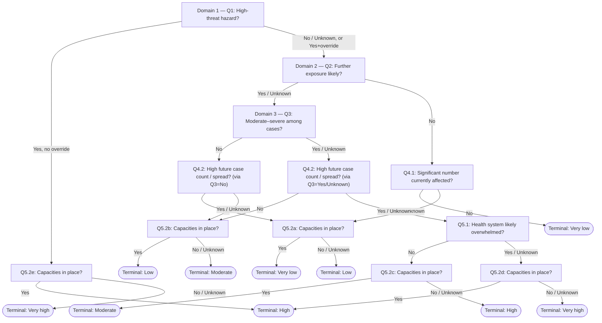

<!--
QIRA decision-tree diagram, matching the corrected routing logic in
references/domains_and_questions.md §6. Render this Mermaid block directly
(GitHub, Obsidian, and most Markdown viewers with Mermaid support will do
so automatically) when a visual aid would help an analyst follow or explain
a walk, or embed it in a bulletin/report output.
-->

**Reading note**: Q5.2a through Q5.2e are the same *question* (Are capacities for prevention and control measures in place?) asked at five different points in the tree — the diagram deliberately draws them as separate nodes because each maps to a different terminal pair. This mirrors the fix applied to `references/domains_and_questions.md` §6 on 2026-07-10, after testing surfaced that an earlier version of this skill collapsed all five into one node.
